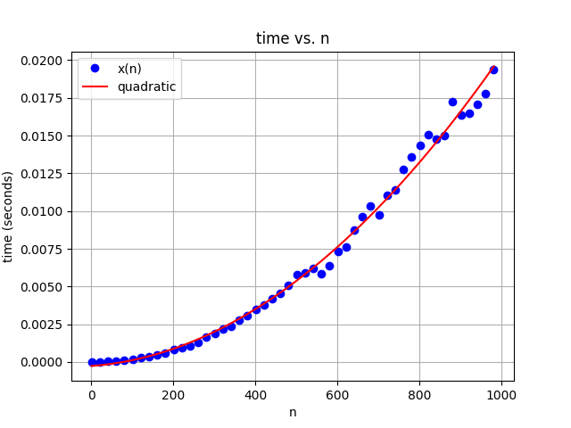
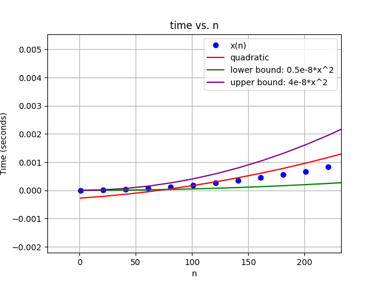
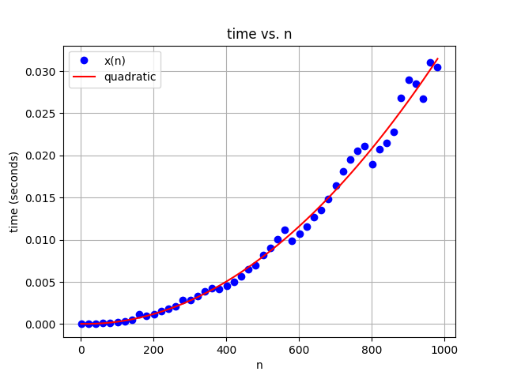

# CSE5311-Hands-On-3

```
  function x = f(n)
1.    x = 1;
2.    for i = 1:n
3.        for j = 1:n
4.            x = x + 1;
```
### 1. Runtime of the algorithm mathematically
| Line # | Cost | Times | 
|:-:|:-:|:-:|
|  1. | $c_1$ |  $1$ |
|  2. | $c_2$ |  $n$ |
|  3. | $c_3$ |  $\sum_{i=1}^{n-1}\sum_{j=1}^n 1$|
|  4. | $c_4$ |  $\sum_{i=1}^{n-1}\sum_{j=1}^{n-1} 1$|

#### Summation Formulas:
- $\sum_{i=1}^n1 = n$
- $\sum_{i=1}^nn = n^2$
- $\sum_{i=1}^n\sum_{j=1}^n1 = \sum_{i=1}^nn = n^2$

```math
T(n) = c_1 + c_2*n + c_3*\sum_{i=1}^{n-1}\sum_{j=1}^n 1 + c_4*\sum_{i=1}^{n-1}\sum_{j=1}^{n-1} 1
```
```math
T(n) = c_1 + c_2*n + c_3*n(n-1) + c_4*(n-1)^2
```
```math
T(n) \approx 2n^2 + n \approx n^2
```
```math
T(n) \in \Theta(n^2)
```

### 2. Function x time vs n plot


Fitted Curve = $1.864\times10^{-8} x^2 - 1.949\times10^{-6} x + 0.0002623$

### 3.  Upper and lower bound polynomials.
Upper Bound = $4 \times 10^{-8} x^2$

Lower Bound = $0.5 \times 10^{-8} x^2$

#### big-O, big-Omega, big-Theta
```math
O(n^2)
\\
\Omega(n^2)
\\
\Theta(n^2)
```


### 4. Location of $n_0$



$n_0 = 100$

It is at this value where the fitted quadratic is inbetween the upper and lower bound, then for all values greater than $n_0$, the fitted quadratic remains inbetween the upper and lower bound.


```
  function x = f(n)
1.    x = 1;
2.    y = 1;
3.    for i = 1:n
4.        for j = 1:n
5.            x = x + 1;
6.            y = i + j;
```

### 5. Will this increase how long it takes the algorithm to run (e.x. you are timing the function like in #2)? 
Yes it does. There are additional instructions (line 2 and 6) which will increase the runtime of this function compared to the function in question 1.



Fitted Curve = $3.361\times10^{-8} x^2 - 9.276 \times 10^{-7} x + 2.686 \times 10^{-5}$

### 6. Will it effect your results from #1?

| Line # | Cost | Times | 
|:-:|:-:|:-:|
|  1. | $c_1$ |  $1$ |
|  2. | $c_2$ |  $1$ |
|  3. | $c_3$ |  $n$ |
|  4. | $c_4$ |  $\sum_{i=1}^{n-1}\sum_{j=1}^n 1$|
|  5. | $c_5$ |  $\sum_{i=1}^{n-1}\sum_{j=1}^{n-1} 1$|
|  6. | $c_6$ |  $\sum_{i=1}^{n-1}\sum_{j=1}^{n-1} 1$|

#### Summation Formulas:
- $\sum_{i=1}^n1 = n$
- $\sum_{i=1}^nn = n^2$
- $\sum_{i=1}^n\sum_{j=1}^n1 = \sum_{i=1}^nn = n^2$

```math
T(n) = c_1 + c_2 + c_3*n + c_4*\sum_{i=1}^{n-1}\sum_{j=1}^n 1 + c_5*\sum_{i=1}^{n-1}\sum_{j=1}^{n-1} 1 + c_6*\sum_{i=1}^{n-1}\sum_{j=1}^{n-1} 1
```
```math
T(n) = c_1 + c_2 + c_3*n + c_4*n(n-1) + c_5*(n-1)^2 + c_6*(n-1)^2
```
```math
T(n) \approx 3n^2 + n \approx n^2
```
```math
T(n) \in \Theta(n^2)
```

No, although the execution time does take longer, the time complexity of the algorithm remains the same.

### 7. Merge sort implementation under implementation/merge_sort
#### To compile:
```
cd implementation/merge_sort
make
```
#### To Run:
```
./merge_sort_exec
```
#### Output:
```
Array: { 5,  2,  4,  7,  1,  3,  2,  6}
Running Merge Sort
Array after Merge Sort: { 1,  2,  2,  3,  4,  5,  6,  7}
```
